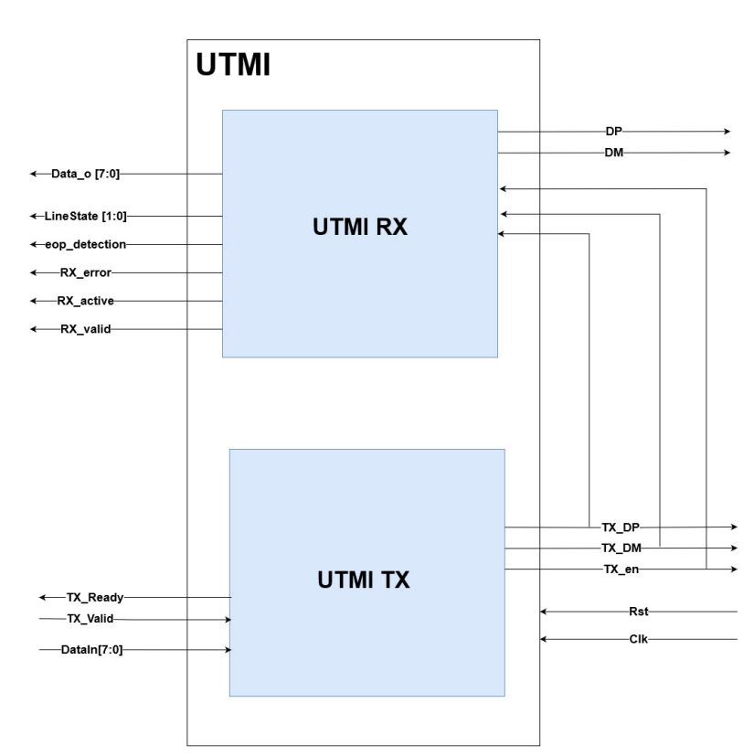
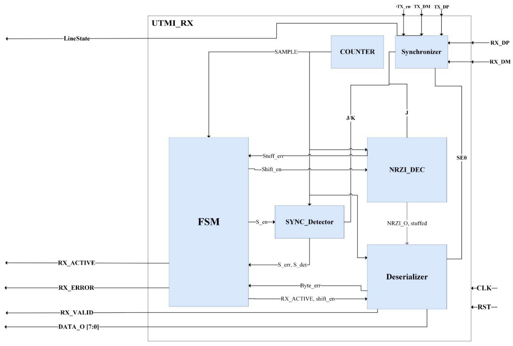
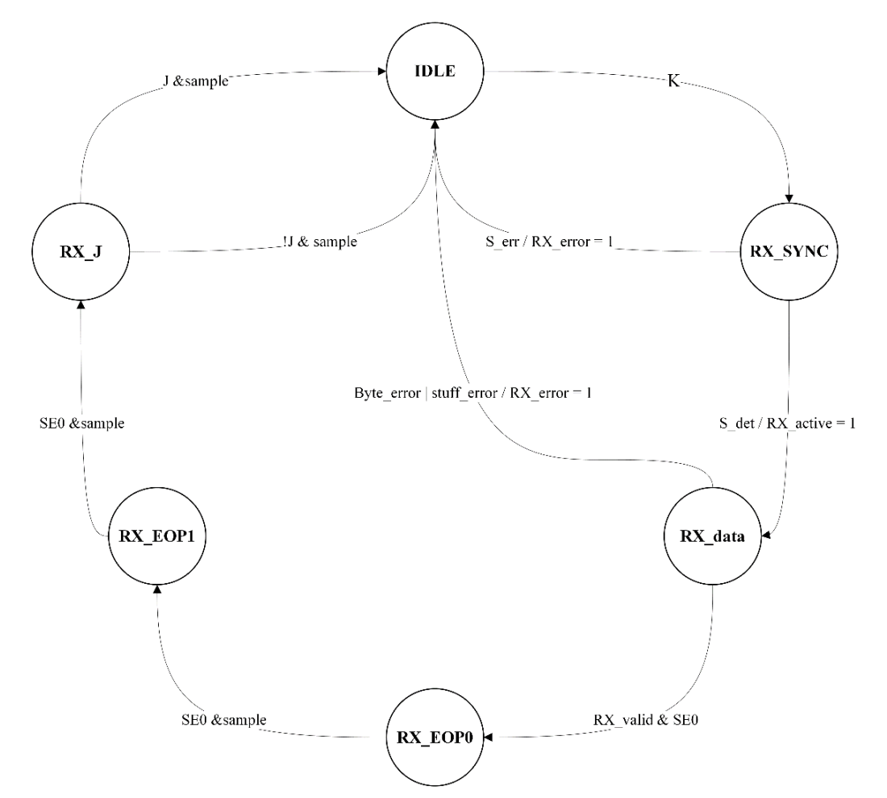

# USB_UTMI
UTMI (USB 2.0 Transceiver Macrocell Interface) is a two wired, bi-directional interface that
handles low level USB protocol and signaling. The USB2.0 specifications define three types 
of UTMI implementations depends on data transmission rates, those are Low Speed 
(1.5MHz) only, Full Speed (12MHz) only and High Speed (480MHz)/Full speed (12MHz).
The UTMI consists of receiving and transmitting systems, responsible for multiple features 
such as; NRZI encoding and decoding, data serialization and deserialization, bit stuffing and 
clock recovery and synchronization

 ### UTMI key features:
 * Supports full Speed (12MHz) only serial data transmission rate.
 * Utilizes 8-bit parallel interface to transmit and receive data (48MHz clock).
 * NRZI encoding and decoding.
 * SYNC/EOP generation and checking.
 * Data and clock recovery and synchronization from the serial stream.
 * Bit-stuffing/Unstuffing; bit stuff error detection.
 * Hold registers to stage transmit and receive data.
 * Receive error reporting

 ### UTMI Block diagram:
  UTMI design is composed of UTMI RX and UTMI TX

 ### UTMI_RX Block diagram:

 ### Blocks discription:
 * `Synchronizer`
   
This Block is responsible for the synchronization and edge detection of the serial bus input 
signals, it also generates the LineState to be used in other USB Blocks.

 * `Counter`
   
This block generates the Clock enable (sample signal) to do 12MHz timing –Full speed data 
rate- the sample signal is generated with respect to the transition (tr) signal to ensure the 
clock enable is in the middle of the input DP, DM transitions.

 * `SYNC Detector`
   
This block contains the SYNC detection FSM and uses 2 control signals (S_det, S_err) to 
indicate SYNC detection or SYNC error.

 * `NRZI Decoder`
   
This block is responsible for NRZI decoding, it also contains the bit Unstuffing logic (if a 
zero is detected after 6 consecutive ones the zero is deleted).

 * `Deserializer`
   
This block is responsible for the input data deserialization, data output on the data_o bus and 
byte bounding error detection.

 * `FSM`
   
Main RX operation FSM to control other blocks and the flow of data.

### UTMI_RX state diagram:

